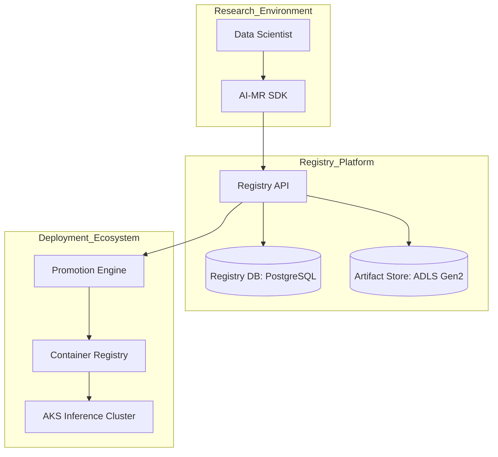
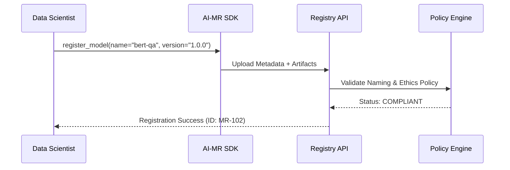
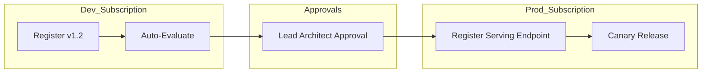
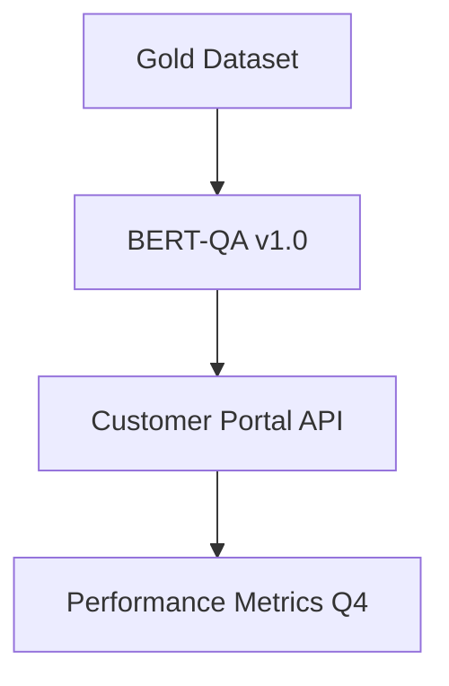

<div align="center">


<h1>AI Model Registry (AI-MR)</h1>

<p><strong>The Industrial Gateway for Model Governance, Lifecycle Orchestration, and MLOps Excellence</strong></p>

[](https://devopstrio.co.uk/)
[](/terraform)
[](/terraform)
[](https://devopstrio.co.uk/)

<br/>

> **"If a model isn't registered, it's a liability."** The AI Model Registry (AI-MR) is a production-hardened platform engineered to manage the birth, life, and transition of intelligent assets across the enterprise.

</div>

---

## 🏛️ Executive Summary

The **Enterprise AI Model Registry (AI-MR)** is a comprehensive platform designed to provide a "Single Source of Truth" for every AI model, LLM, prompt, and agent within the organization. By centralizing versioning, lineage, and auditability, AI-MR transforms fragmented research into institutional intelligence.

### Strategic Business Outcomes
- **Governed Scalability**: Deploy AI to production with 100% confidence in version provenance.
- **Audit-Ready Compliance**: Automatic generation of "Model Cards" and "Risk Scores" for regulatory review.
- **Enhanced ROI**: Maximize asset reuse through a globally searchable model and prompt catalog.
- **Drift Intelligence**: Continuous monitoring ensures models perform as promised in the real world.

---

## 🏗️ Technical Architecture

### 1. High-Level Blueprint


### 2. Model Registration & Lifecycle Flow


### 3. Model Promotion Workflow (Dev -> Prod)


---

## 📦 Supported Intelligent Assets

| Asset Type | Versioning Logic | Storage Target |
|:---|:---|:---|
| **ML Models** | Semantic (1.2.0) | ONNX / Pickle / Weights |
| **LLM Models** | Checkpoint-based | safetensors / GGUF |
| **Prompts** | Dynamic Template ID | Registry Metadata |
| **Agents** | DAG Versioning | JSON Manifest |
| **Datasets** | Snapshot Hash | ADLS Gen2 Parquet |

---

## 🛡️ Governance & Policy Guardrails

AI-MR enforces institutional standards through the **Integrated Policy Engine**:
- **Metadata Whitelisting**: Every model must carry an "Owner", "Financial Code", and "Purpose" tag.
- **Responsible AI Scorecard**: Automatic checks for bias, fairness, and safety benchmarks during registration.
- **Immutable Ledger**: All changes to model status (Promoted, Retired, Rejected) are permanent and auditable.

### Lineage Graph Visualization


---

## 🚀 Deployment & SDK Usage

### Python SDK Example
```python
from aimr import Registry

client = Registry(api_key="dt_key_...")
model = client.register(
    name="retail-churn-forecast",
    artifacts="./models/final_weights.bin",
    metrics={"auc": 0.94, "precision": 0.89}
)
```

---

## 🗺️ Platform Roadmap

- **Phase 1 (Release 1.0)**: Core SQL/Blob registration & versioning.
- **Phase 2 (v1.2)**: Automated Drift Alerting & SLI/SLO dashboards.
- **Phase 3 (v2.0)**: "Autonomous Retraining"—Models trigger their own updates based on drift logs.

---

## 🆘 Support & Scaling
Devopstrio provides **AI-MR Platform-as-a-Service** for mission-critical ML and LLM operations.

- **Portal**: [registry.devopstrio.co.uk](https://devopstrio.co.uk)
- **Consulting**: [mlops-ops@devopstrio.co.uk](mailto:mlops-ops@devopstrio.co.uk)

---
<sub>&copy; 2026 Devopstrio &mdash; Mastering the Intelligent Enterprise.</sub>
